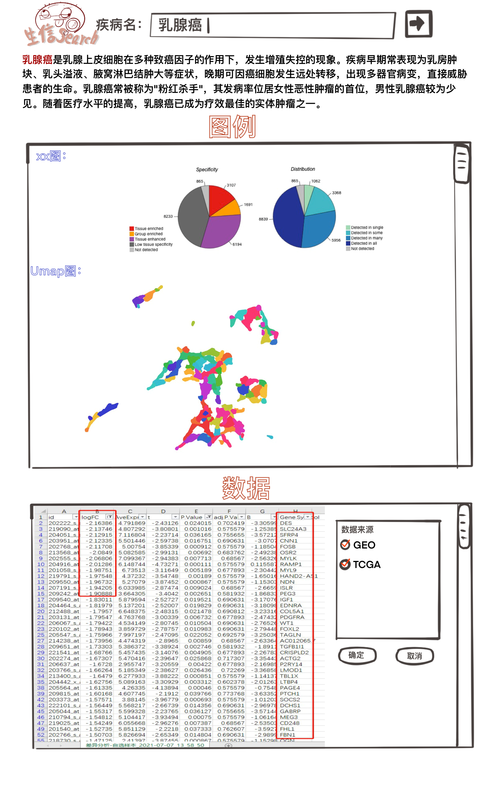

# parodyatlas
这是生物信息学1801实训作业
<!-- * **甲方**: 胡德华 -->
<!-- **乙方**: -->
*  赵书莹、陈姝亦、黄海盛、李阿鹏、黎宸彰、卢文庆、雷宇、巫肇曦、杨子奕、张彦哲、郑思悦

<!-- ## 甲方要求(无书面要求，描述不全) -->

## 要求
* 仿制[ProteinAtlas](https://www.proteinatlas.org/)
* 使用TCGA(tumer arrays)、GEO(mt-DNA/RNA)、proteomics，并整合
* 能器官水平显示各类组学数据
* 拥有非常炫酷的数据可视化和交互功能，包含搜索功能
<!-- ## 甲方设计工作流 -->
* 要求**2021.11.14**前给出设计方案(未落实)
* 要求自**2021.11.08**日起，到**2022.01.23**结束，期间每日**08:00-17:00**待在后栋219进行开发工作(未落实)
* 要求**2022.01.23**前完成肝癌或者小细胞癌的案例
* 2022.01.21上交实训报告
* 2019级在2022年底继续开发其他disease
## 设计思路

1. 用户输入搜索疾病  
2. 程序处理用户搜索词，向各个疾病-组学数据库爬取部分数据集，返回疾病简介，和数据集链接，给用户选择  
3. 用户选择合适数据集，使用本程序的爬虫自动下载  
4. 本程序的脚本自动解析数据，并作图分析  
* **Search** -<font color=green>done</font>-> **OMIM疾病简介** 
* **Search** -<font color=green>done</font>-> **GEO Paper** -<font color=blue>user select</font>-> **GSE ID** -<font color=red>undone</font>-> **data analysis**(<font color=red>undone</font>)
* **Search** -<font color=red>unable</font>-> **TCGA file names** -<font color=blue>user select</font>-> **manifests** -<font color=green>done</font>-> **data analysis**(<font color=red>undone</font>)

### page草图  

### 类关系图
```mermaid
{
    class待添加{
        pass
    }
}
```

### 前端
设计：`杨子亦`  
```html
{
    "Home":"search"
    "Members": Hudehua
    xxxx cancer page
    "Instructions":"分析流程"
```
realization  
分工：`巫肇曦`,`黄海盛`
### 爬虫
search word->spyder->parser->`.json`  
分工：`张彦哲`  

## 数据分析
GSEIDs/TCGA data -> results as 炫酷的静态图，预处理后的数据  
分工：`郑思悦`  

## 缺少服务器与数据
* 假后台：预爬去数据（代表性数据集） 
* 静态前端  
## 定位人群
入门xxx癌症的研究生新生  
## 功能
1. 整合不同组学数据链接合集  
2. 代表类型(citation高)的数据的概览: 火山图(`郑思悦`)  

## 快速体验
[github pages](https://csubioinformatics1801.github.io/parodyatlas/)

## Reference
1. [tcga_downloader](https://github.com/zd200572/tcga_downloader)  
2. [tcga_data_autodownload](https://github.com/murphy-mtt/bio/blob/543c1d69dbec5a263e199c0d5c02baf8d5ec9a15/download_tcga.py)  
3. [SnagerBox](http://sangerbox.com/Index)
4. Liu, Xiangxiang, et al. "Elevated circulating miR-182 acts as a diagnostic biomarker for early colorectal cancer." Cancer Management and Research 10 (2018): 857.  
