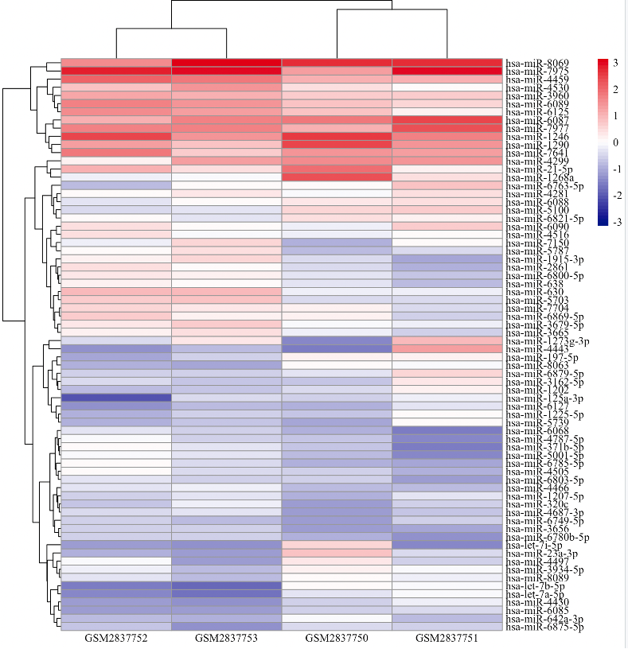
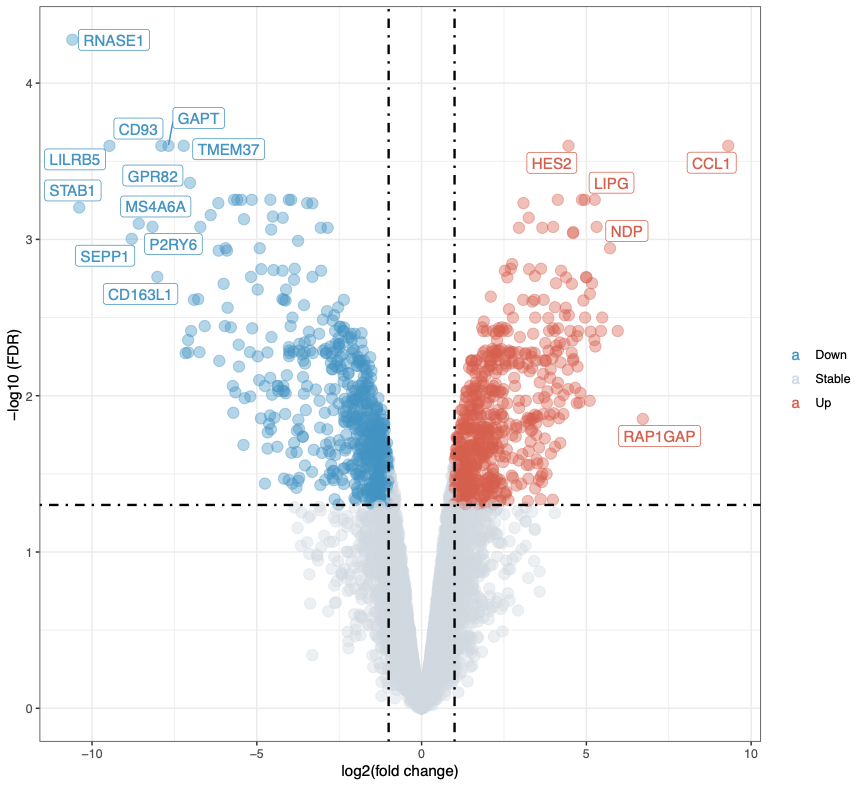
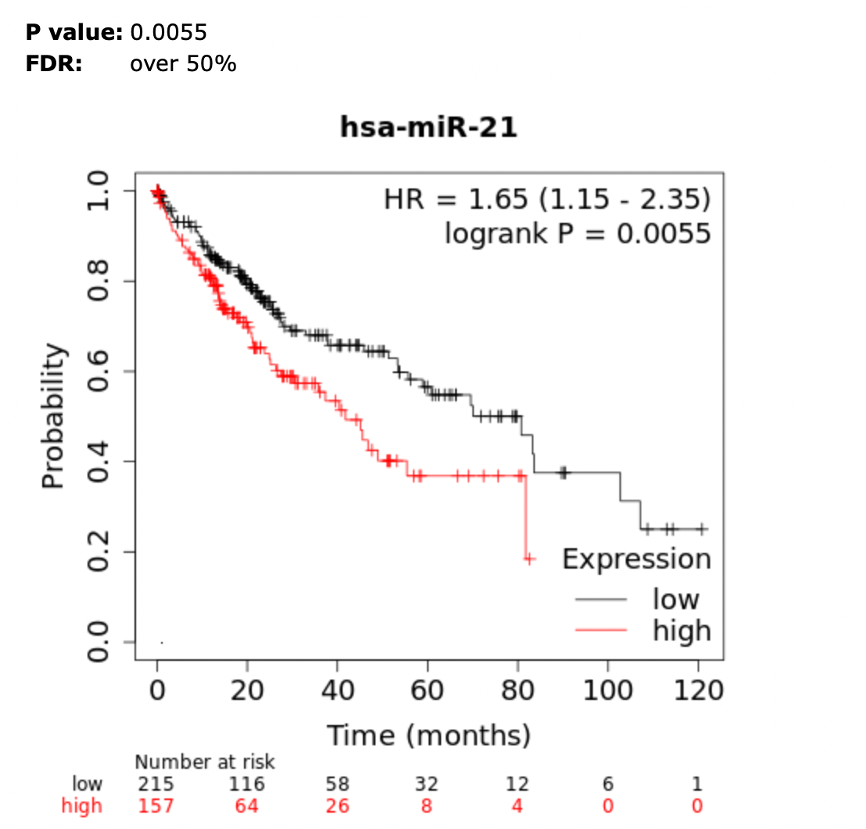

# MicroRNA数据分析（GEO GSE66805 GSE95405&TCGA-LIHC）

```R
library(RColorBrewer)
library(pheatmap) # 加载包
library(ggplot2) # 加载包
library(ggrepel) # 加载包
library(eulerr)


# 热图生成（数据GSE66805 GSE95405）
data2<-read.csv('70-high.csv',header = TRUE, sep = ",", quote = "\"",dec = ".", fill = TRUE, comment.char = "", )
rownames(data2)<-data2[,1]
data2<-data2[,-1]
p1<-pheatmap(data2, scale = "column",color = colorRampPalette(c("navy", "white", "firebrick3"))(50),fontfamily= "Times New Roman",angle_col = 0)
```


```R
#火山图
P<-ggplot(
  #设置数据
  diffall, 
  aes(x = log2FC, 
      y = -log10(FDR), 
      colour=change)) +
  geom_point(alpha=0.4, size=3.5) +
  scale_color_manual(values=c("#4393C3", "#d2dae2","#D6604D"))+
  
  # 辅助线
  geom_vline(xintercept=c(-1,1),lty=4,col="black",lwd=0.8) +
  geom_hline(yintercept = -log10(cut_off_FDR),lty=4,col="black",lwd=0.8) +
  
  # 坐标轴
  labs(x="log2(fold change)",
       y="-log10 (FDR)")+
  theme_bw()+
  
  # 图例
  theme(plot.title = element_text(hjust = 0.5), 
        legend.position="right", 
        legend.title = element_blank()
  )

diffall$label=ifelse(diffall$FDR < cut_off_FDR & diffall$log2FC >= 1.827, 
                     rownames(diffall),'')
#加注释
P+ggrepel::geom_label_repel(
  aes(label=label),diffall
)
ggsave("mir-21.pdf",width = 22, height = 20, units = c("cm"))
```


```R
#生存曲线
#先从数据库里找到符合各项参数要求的数据
query <- GDCquery(project = "TCGA-LIHC", 
                  legacy = FALSE, 
                  experimental.strategy = "RNA-Seq", 
                  data.category = "Transcriptome Profiling", 
                  data.type = "Gene Expression Quantification", 
                  data.type = "miRNA Expression Quantification"
                  workflow.type = "HTSeq - Counts")

#再使用命令GDCdownload(）下载
GDCdownload(query)                 
                  data<-read.table("miRNA_HiSeq_gene",header = TRUE, sep = "\t", quote = "\"",dec = ".", fill = TRUE, comment.char = "", )
rownames(data)<-data[,1]
data<-data[,-1]
              
metadata<-read.table("nationwidechildrens.org_clinical_follow_up_v4.0_nte_lihc.txt",header = TRUE, sep = "\t", quote = "\"",dec = ".", fill = TRUE, comment.char = "", )

metadata<-metadata[-1,]

data1<-data1ro
data1<-data[c('MIMAT0000076','MIMAT0007891','MIMAT0027658'),]

data2<-read.table("TCGA-LIHC.mirna.tsv",header = TRUE, sep = "\t", quote = "\"",dec = ".", fill = TRUE, comment.char = "", )
metadata2<-read.table("TCGA-LIHC.survival.tsv",header = TRUE, sep = "\t", quote = "\"",dec = ".", fill = TRUE, comment.char = "", )
rownames(data2)<-data2[,1]
data2<-data2[,-1]
GENE=t(data2[which(row.names(data2)=="hsa-mir-21"),])
med=17.3

GENE=data.frame(GENE)
GENE[GENE$hsa.mir.21>med,"level"]<-"High"
GENE[GENE$hsa.mir.21<=med,"level"]<-"Low"

t=metadata2

T=data.frame(gsub("-",".",t$sample),t)

colnames(T)[1]="SampleID"

T=T[,-2]
Clinical=T

gene_clinical=data.frame(Clinical[match(rownames(GENE),Clinical$SampleID),],GENE)

gene_clinical$level<- ifelse ((gene_clinical$level =="High"), 1,2)

GC=gene_clinical
GC$OS.time<-GC$OS.time/365
GC=GC[which(GC$OS.time<7),]
GC=GC[which(GC$OS==1),]

fit.surv <-Surv(GC$OS.time,GC$OS)
km<-survfit(fit.surv~1,data = GC)
km_2<- survfit(fit.surv~level,data=GC)
ggsurvplot(km_2, main = "Survival curve",
           pval=TRUE  #添加P值
)         
Med=median(GENE$hsa.mir.21)
mean=mean(GENE$hsa.mir.21)
ggsurvplot (km_2)
```


```R
ggsurvplot (km)
```

