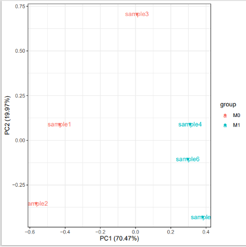
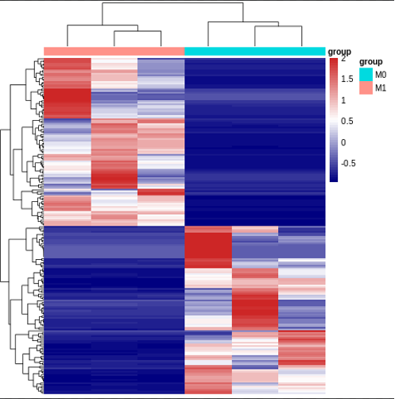
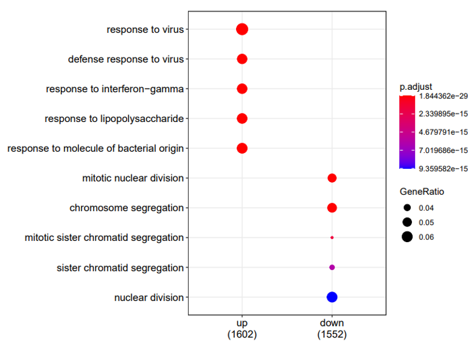
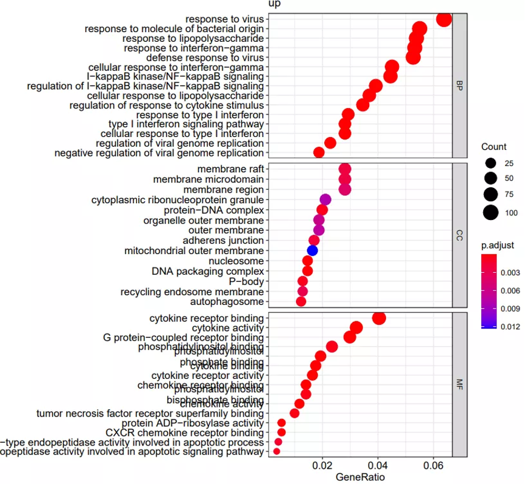
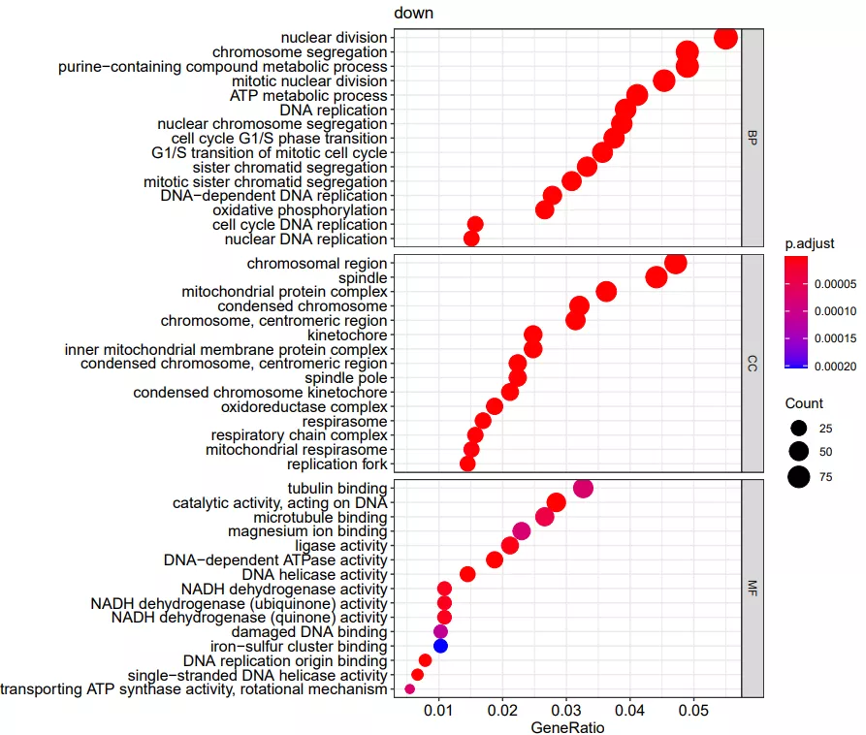
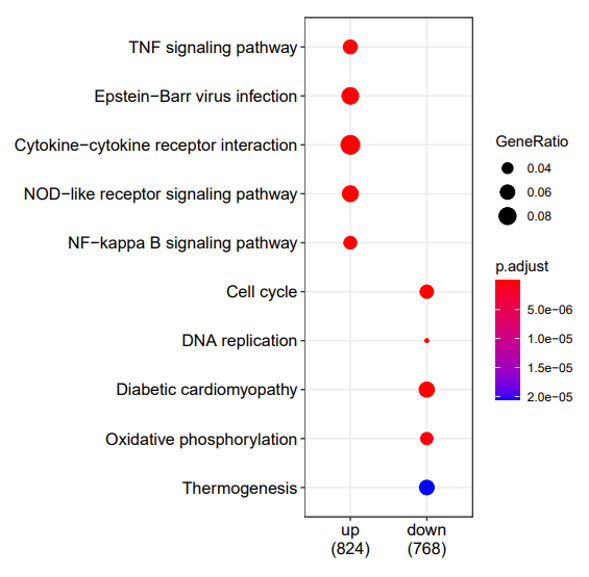
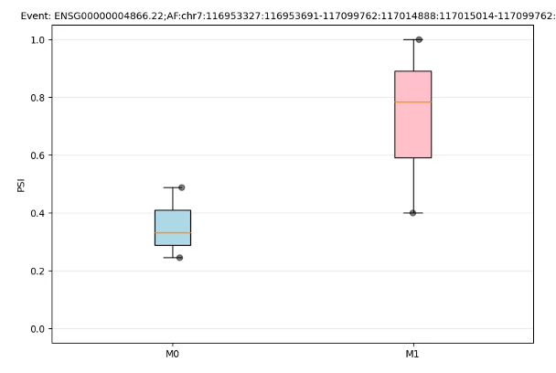

# RNA-seq分析

## 数据

数据集为GSE149638， 2x101 bp paired-end RNA-seq，Illumina HiSeq 2500 with poly-A selection。源于健康人的M0和M1 macrophages。原始数据M0和M1各有48个重复（挑选3个重复进行分析）

## 差异分析

```R
library(GenomicFeatures)
library(AnnotationDbi)
library(tximport)
library(DESeq2)

### 我们直接从gtf注释文件（和基因组转录组对应版本的注释）获得基因和转录本的对应关系
hg38_txdb <- makeTxDbFromGFF("../ref/gencode.v38.annotation.gtf",
                                format="gtf",
                                organism="Homo sapiens",
                                dbxrefTag = "gene_name")

k <- keys(hg38_txdb, keytype = "TXNAME")
tx2gene <- select(hg38_txdb, k, "GENEID", "TXNAME")

head(tx2gene)                                                                                                                                                                                                                    
#             TXNAME            GENEID
#1 ENST00000456328.2 ENSG00000223972.5
#2 ENST00000450305.2 ENSG00000223972.5
#3 ENST00000473358.1 ENSG00000243485.5
#4 ENST00000469289.1 ENSG00000243485.5
#5 ENST00000607096.1 ENSG00000284332.1
#6 ENST00000606857.1 ENSG00000268020.3

quant.files <- list.files("../salmon_output", pattern = "quant.sf",
                          full.names = T, recursive = T)
txi <- tximport(quant.files, type = "salmon", tx2gene = tx2gene)
names(txi)                                                                                                                                                                                                                       
# [1] "abundance"           "counts"              "length"              "countsFromAbundance"


sampleTable <- data.frame(condition = factor(rep(c("M0", "M1"), each = 3)))
rownames(sampleTable) <- paste0("sample", 1:6)

### DESeq2提供了直接从Tximport构建数据的函数
dds <- DESeqDataSetFromTximport(txi, sampleTable, ~condition)

## 过滤一下，6个样本总counts数大于60
keep <- rowSums(counts(dds)) >= 60
dds <- dds[keep,]
PCA作图
### pca 作图
library(ggfortify)

## normalization
count.sf <-  estimateSizeFactors(dds)
normal.mtx <- counts(count.sf, normalized=T)
df_all <- cbind(t(normal.mtx), data.frame(group=c(rep('M0', 3),rep('M1', 3))))

pca_data <- prcomp(t(normal.mtx ), scale. = F)
autoplot(pca_data, data = df_all, colour = 'group', label = TRUE) + theme_bw()

```

  
PCA图  

## 差异基因计算

```R
### 差异分析
deseq2.obj <- DESeq(dds)

# 获取结果
res <- results(deseq2.obj)
res.df <- as.data.frame(res)

r$> head(res.df)                                                                                                                                                                                                                          
                     baseMean log2FoldChange     lfcSE       stat       pvalue         padj
ENSG00000000003.15   12.78531    -1.15948975 1.0905031 -1.0632613 2.876635e-01 3.982777e-01
ENSG00000000419.14 1153.61638    -0.05190081 0.2331701 -0.2225878 8.238563e-01 8.760466e-01
ENSG00000000457.14  842.03593     2.47434389 0.3036221  8.1494188 3.656775e-16 8.626111e-15
ENSG00000000460.17  264.26436    -1.72342072 0.4529815 -3.8046160 1.420244e-04 5.627837e-04
ENSG00000000938.13 6142.70208    -2.29502017 0.3162089 -7.2579238 3.930770e-13 6.552265e-12
ENSG00000000971.16 1376.49691     4.16870903 0.5808924  7.1763881 7.157718e-13 1.156001e-11

r$> keep <- abs(res$log2FoldChange) > 1.5 & res$padj < 0.01                                                                                                                                                                         
r$> deg <- res.df[keep, ]                                                                                                                                                                                                           
r$> dim(deg)  

```

```bash
[1] 4083    6
```

## 热图绘制

```R
## 使用 https://mp.weixin.qq.com/s/NC5mKwAsYbm1Q-PFC5IEOg 代码
library(pheatmap)

dat <- normal.mtx
FC <- res.df$log2FoldChange
names(FC) <- rownames(res.df)

# 排序差异倍数，提取前100和后100的基因名
DEG_200 <- c(names(head(sort(FC),100)),names(tail(sort(FC),100)))

# 提取基因的归一化
dat <- t(scale(t(dat[DEG_200,])))

group_list <- df_all$group
# 添加注释条
group <- data.frame(group=group_list)
rownames(group) <- colnames(dat)


# 大于2的值赋值为2
dat[dat > 2] <- 2
# 低于-2的值赋值为-2
dat[dat < -2] <- -2
pheatmap(dat, cluster_cols = T,
         show_colnames =F,show_rownames = F,
         annotation_col=group,
         color = colorRampPalette(c("navy", "white", "firebrick3"))(50))

```



## 富集分析

### GO富集

```R
library(org.Hs.eg.db)
library(clusterProfiler)

## 获取上下调基因
deg.up <- res.df[res$log2FoldChange > 1.5 & res$padj < 0.01, ]
deg.down <- res.df[res$log2FoldChange < -1.5 & res$padj < 0.01, ]

## 去除ENSEMBL ID的版本号
deg.up.gene <- gsub("\\..*", "",  rownames(deg.up))
deg.down.gene <- gsub("\\..*", "",  rownames(deg.down))

deg.ls <- list(up = deg.up.gene, down = deg.down.gene)

ego.cmp <- compareCluster(deg.ls ,
                    fun          = "enrichGO",
                    qvalueCutoff = 0.01, 
                    pvalueCutoff = 0.05, 
                    ont          = 'BP',
                    keyType      = "ENSEMBL",
                    OrgDb        = org.Hs.eg.db,
                    )

dotplot(ego.cmp)

up.ego <- enrichGO(gene       = deg.up.gene,
                keyType       = "ENSEMBL",
                OrgDb         = org.Hs.eg.db,
                ont           = "ALL",
                pAdjustMethod = "BH",
                pvalueCutoff  = 0.05,
                qvalueCutoff  = 0.01,
                readable      = TRUE,
                pool          = TRUE)

dotplot(up.ego, split="ONTOLOGY", showCategory = 15, title = "up") + 
                    facet_grid(ONTOLOGY~., scale="free")


down.ego <- enrichGO(gene     = deg.down.gene,
                keyType       = "ENSEMBL",
                OrgDb         = org.Hs.eg.db,
                ont           = "ALL",
                pAdjustMethod = "BH",
                pvalueCutoff  = 0.05,
                qvalueCutoff  = 0.01,
                readable      = TRUE,
                pool          = TRUE)

dotplot(down.ego, split="ONTOLOGY", showCategory = 15, title = "down") + 
                    facet_grid(ONTOLOGY~., scale="free")

```

  
  
  

### KEGG富集

```R
### KEGG富集，需要使用ENTREZID
deg.up.gene.ei <- bitr(deg.up.gene, fromType = "ENSEMBL", toType = "ENTREZID", OrgDb = org.Hs.eg.db)$ENTREZID
deg.down.gene.ei <- bitr(deg.down.gene, fromType = "ENSEMBL", toType = "ENTREZID", OrgDb = org.Hs.eg.db)$ENTREZID

deg.ei.ls <- list(up = deg.up.gene.ei, down = deg.down.gene.ei)


kegg.cmp <- compareCluster(deg.ei.ls,
                            fun = "enrichKEGG",
                            qvalueCutoff = 0.01, 
                            pvalueCutoff = 0.05, 
                            organism = "hsa"
                            )
dotplot(kegg.cmp)

#### 单个富集查看的话，用函数enrichKEGG

```

  

## 可变剪切分析

可变剪切分析，这里使用SUPPA2 来进行。据作者说，这是一个又快，准确度又高，对样本测序深度要求还低的软件。  
PSI（proportion spliced-in）作为可变剪切中常见的评估指标，用于衡量可变剪切发生率。在不同软件中，计算可能有所不同。举一个skipping exon的例子，若F1 表示那些包含某个exon (这里研究local AS events, 指特定的一个exon)的转录本，F2 表示那些不包含那个exon 的转录本。则PSI。  
箱型图绘制，查看某个AS event的psi value.（Python  

```bash
wget https://raw.githubusercontent.com/comprna/SUPPA/master/scripts/generate_boxplot_event.py
python generate_boxplot_event.py -i HMDM_as_event.psi -e "ENSG00000004866.22;AF:chr7:116953327:116953691-117099762:117014888:117015014-117099762:+" -g 1-3,4-6 -c M0,M1 -o .
```

